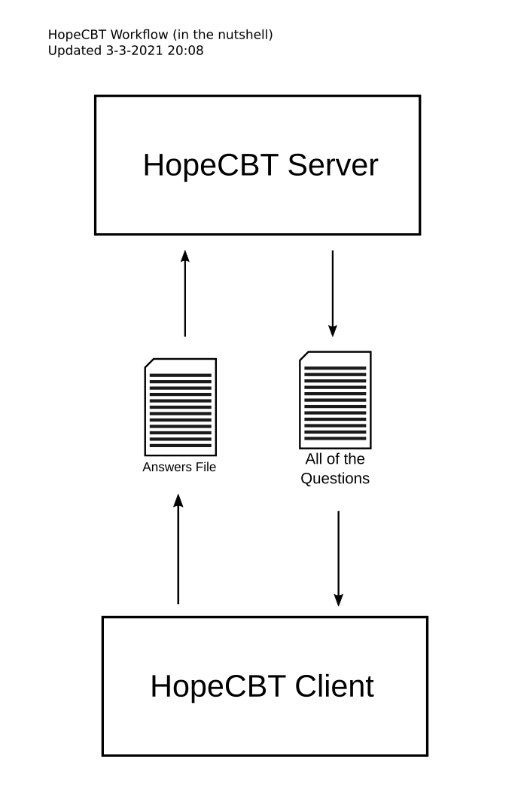

# HopeCBT
A Hopefully Lightweight and unFrustating CBT System Developed in Python

# Editing the UI Files

On Windows You can install pyqt5-tools from Pypi to edit the ui files and run `pyqt5-tools designer` from `cmd` or `run` to open Qt Designer

On Linux you can try install Qt Designer from your distro package manager

# Workflow in the nutshell

